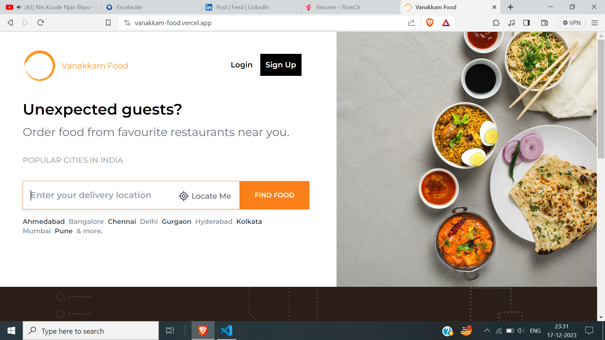

<div align="center">
  
  <br/>

  <h3><b>Vanakkam Food Ordering App</b></h3>
</div>

<!-- TABLE OF CONTENTS -->

## Table of Contents

- [📖 About the Project](#introduction)
  - [🛠 Built With](#built-with)
    - [Tech Stack](#)
    - [Key Features](#key-features)
  - [🚀 Live Demo](#live-demo)
- [💻 Getting Started](#getting-started)
  - [Installation & Running Instructions](#installation--running-instructions)
- [🔭 Future Features](#future-features)
- [⭐️ Show your support](#show-your-support)

<!-- PROJECT DESCRIPTION -->

## Introduction

# 🚀 [VanakkamFood] <a name="about-project"></a>

> VanakkamFood, a React.js-based food ordering app, seamlessly connects users with their favorite dishes through the live Swiggy API. With Redux for state management, React Router DOM for smooth navigation, and Tailwind CSS for a visually appealing interface, it offers a modern and efficient way to explore, order, and enjoy a diverse range of culinary delights.

[comment]: # (Image link that takes to linkedin-post)
[](https://www.linkedin.com/feed/update/urn:li:activity:7132738486276608000/)

## Built With

### Tech Stack <a name="tech-stack"></a>

* ReactJs
* Redux Toolkit
* Tailwind-CSS


<!-- Features -->

## key-features

### 🎯 Key Features <a name="key-features"></a>

> 🎥 Dynamic Content: VanakkamFood ensures a vibrant user experience by dynamically updating content, offering real-time information on menus, availability, and promotions, keeping users engaged with the latest offerings.

> 📌Seamless Navigation: With React Router DOM, the app provides a smooth and intuitive navigation experience, enabling users to effortlessly explore different sections, from discovering restaurants to tracking orders, without disruptions.

> 🌏Swiggy Live APIs Integration for generating data about restaurants: Leveraging live Swiggy APIs, VanakkamFood delivers up-to-the-minute data on restaurants, empowering users with accurate and reliable information to make informed choices when selecting their preferred dining options.

> 🔐State Management with Redux: VanakkamFood ensures a scalable and organized application state with Redux, streamlining data flow and providing a centralized management system for a seamless user experience.

> 🔖 Search Results Caching: The app optimizes performance by caching search results, enhancing speed and responsiveness for users who frequently search for specific restaurants or cuisines.

> 🔍Optimized Search: VanakkamFood employs an optimized search functionality, enabling users to swiftly find their desired restaurants or dishes, enhancing the overall user experience.

> 🚀Lazy Loading & Code Splitting: The application optimizes performance by employing lazy loading and code splitting techniques, ensuring that only necessary components are loaded, thereby reducing initial page load times and improving overall responsiveness.

> ⚡Custom Hook: VanakkamFood utilizes custom hooks, enhancing code reusability and maintainability, allowing for a more efficient development process and a streamlined architecture.

> 🚀Optimized API Requests: The app minimizes network overhead by optimizing API requests, ensuring efficient communication between the front-end and Swiggy's live APIs, resulting in faster data retrieval and improved user experience.

> ✨Shimmer UI: VanakkamFood enhances user interface transitions with shimmer UI, providing a visually appealing loading effect during data retrieval, creating a polished and engaging experience for users while waiting for content to load.

<!-- - **[Swiggy Live APIs Integration]**
- **[State Management]**
- **[Shimmer UI]** -->

## Live-demo

## 🚀 Live Demo <a name="live-demo"></a>

- Click on the below given link to get the preview.

 <a href="">

</a>

[⬆️ Back to Top](#table-of-contents)

### Installation & Running Instructions

First step is to “Fork” the project under your name and keep the `main` branch always sync’d with this repository to ensure there are no issues with your Pull Request like those dreaded Merge Conflicts! 😈

1. Clone the Repository (your fork) and make sure it’s in the latest `main` branch.
2. If you think it might be stale, issue a `git pull` so that it’s up to date.
3. If you’re running for the first time, install the dependencies by running `npm ci` (or if you’re not lazy, run `npm clean-install`).
4. Once the installation is over, start the app locally by running `npm start`.
5. Hope everything works, check by opening http://localhost:5173/ on your browser (it might have already started your browser, kindly check).

Here are all the commands...

```bash
$ git clone https://github.com/<Your-GitHub-Username>/GitHub-ReadMe.git
$ npm i
$ npm run dev
```

If `npm ci` gives issues on Windows or Linux machines, please use `npm i` (or if you’re not lazy, run `npm install`).

If you’re facing any issues, feel free to message me on WhatsApp / LinkedIn / Twitter / Discord / Email (on the order of responsivenes, email being the slowest)! 😅


<!-- FUTURE FEATURES -->

## Future Features

> 💳Quick and Safe Payments: Soon, ordering food will be even easier with a magic button that lets you pay in a blink, and your account will be guarded by a super-smart lock with passwords and secret handshakes.

> 🔐Easy Login with Google: In the future, logging into your favorite app could be a breeze – just one click using your Google account. It's like having a VIP pass to your app world!

<!-- - **[Payment Mode Integration]**
- **[User Authentication]** -->

## Show your support <a name="support"></a>

> "If you enjoy this project, I'd greatly appreciate your support. Consider sharing it with others who might find it useful. Your contribution helps me grow and improve. 🚀, Don't Hesitate for starring this GitHub repoistory! "

[⬆️ Back to Top](#table-of-contents)