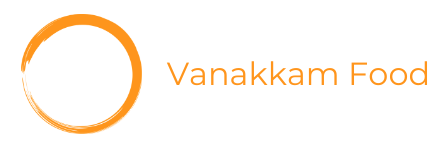

  <!-- You are encouraged to replace this logo with your own! Otherwise you can also remove it. -->
  
   

  <h3><b>Vanakkam Food Ordering App</b></h3>

<!-- TABLE OF CONTENTS -->

- [📖 About the Project](#about-project)
  - [🛠 Built With](#built-with)
    - [Tech Stack](#tech-stack)
    - [Key Features](#key-features)
  - [🚀 Live Demo](#live-demo)
- [💻 Getting Started](#getting-started)
  - [Setup](#setup)
  - [Install](#install)
  - [Deployment](#deployment)
- [👥 Authors](#authors)
- [🔭 Future Features](#future-features)
- [🤝 Contributing](#contributing)
- [⭐️ Show your support](#support)
- [🙏 Acknowledgements](#acknowledgements)

<!-- PROJECT DESCRIPTION -->

# 🚀 [VanakkamFood] 

> VanakkamFood, a React.js-based food ordering app, seamlessly connects users with their favorite dishes through the live Swiggy API. With Redux for state management, React Router DOM for smooth navigation, and Tailwind CSS for a visually appealing interface, it offers a modern and efficient way to explore, order, and enjoy a diverse range of culinary delights.

## 🛠 Built With 

### Tech Stack 

* ReactJs
* Redux
* Tailwind-CSS

<!-- Features -->

### 🎯 Key Features 

> 🎥 Dynamic Content: VanakkamFood ensures a vibrant user experience by dynamically updating content, offering real-time information on menus, availability, and promotions, keeping users engaged with the latest offerings.

> 📌Seamless Navigation: With React Router DOM, the app provides a smooth and intuitive navigation experience, enabling users to effortlessly explore different sections, from discovering restaurants to tracking orders, without disruptions.

> 🌏Swiggy Live APIs Integration for generating data about restaurants: Leveraging live Swiggy APIs, VanakkamFood delivers up-to-the-minute data on restaurants, empowering users with accurate and reliable information to make informed choices when selecting their preferred dining options.

> 🔐State Management with Redux: VanakkamFood ensures a scalable and organized application state with Redux, streamlining data flow and providing a centralized management system for a seamless user experience.

> 🔖 Search Results Caching: The app optimizes performance by caching search results, enhancing speed and responsiveness for users who frequently search for specific restaurants or cuisines.

> 🔍Optimized Search: VanakkamFood employs an optimized search functionality, enabling users to swiftly find their desired restaurants or dishes, enhancing the overall user experience.

> 🚀Lazy Loading & Code Splitting: The application optimizes performance by employing lazy loading and code splitting techniques, ensuring that only necessary components are loaded, thereby reducing initial page load times and improving overall responsiveness.

> ⚡Custom Hook: VanakkamFood utilizes custom hooks, enhancing code reusability and maintainability, allowing for a more efficient development process and a streamlined architecture.

> 🚀Optimized API Requests: The app minimizes network overhead by optimizing API requests, ensuring efficient communication between the front-end and Swiggy's live APIs, resulting in faster data retrieval and improved user experience.

> ✨Shimmer UI: VanakkamFood enhances user interface transitions with shimmer UI, providing a visually appealing loading effect during data retrieval, creating a polished and engaging experience for users while waiting for content to load.

<!-- - **[Swiggy Live APIs Integration]**
- **[State Management]**
- **[Shimmer UI]** -->

## 🚀 Live Demo 

> Add a link to your deployed project.

- [Live Demo Link](https://google.com)

(<a href="#readme-top">back to top</a>)

<!-- FUTURE FEATURES -->

## 🔭 Future Features 

> Describe 1 - 3 features you will add to the project.

- **[Payment Mode Integration]**
- **[User Authentication]**
<!-- - **[]** -->

## ⭐️ Show your support 

> Write a message to encourage readers to support your project

If you like this project...

(<a href="#readme-top">back to top</a>)
